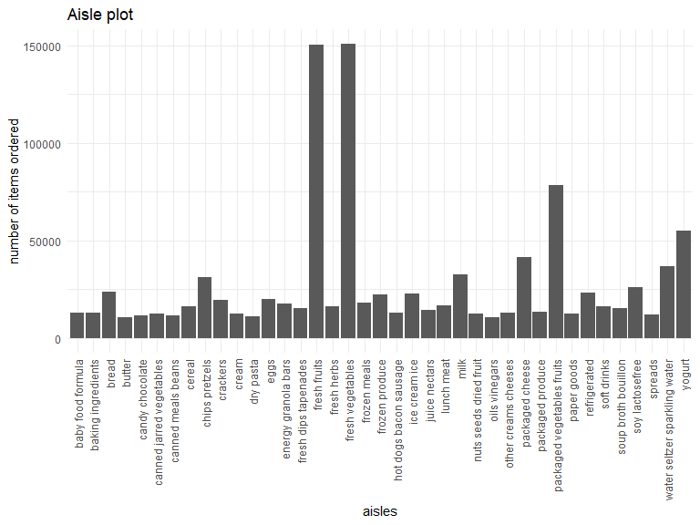
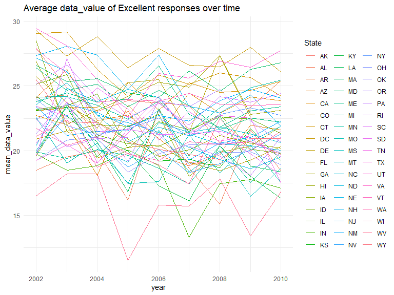
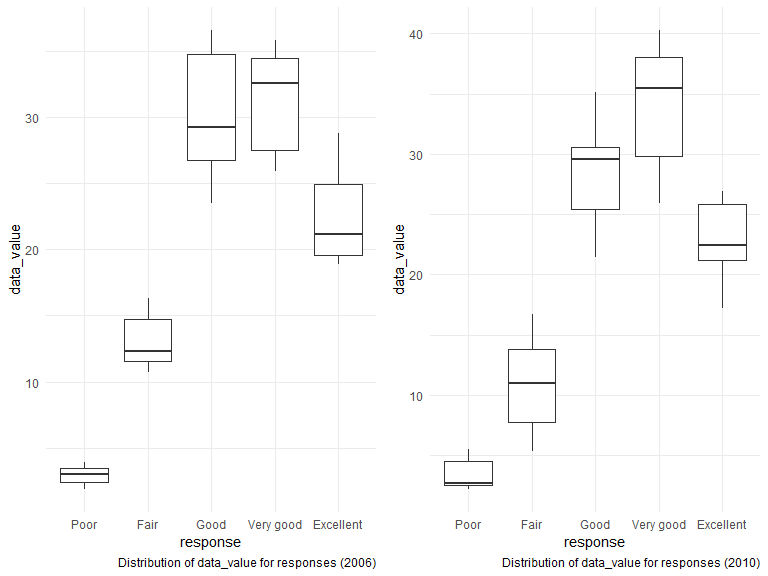
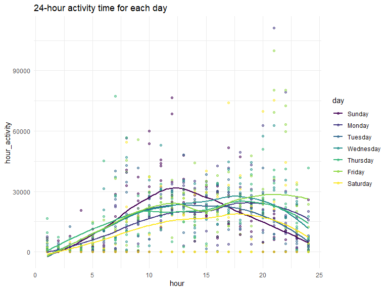

p8105\_hw3\_yl4359
================
Yue Lai
10/3/2019

# Problem 1

``` r
data("instacart")
```

There are 1384617 rows and 15 columns in the *instacart* dataset. The
key variables are `aisles`, `product_name`, `department` and `order_id`.

  - How many aisles are there, and which aisles are the most items
    ordered from?

<!-- end list -->

``` r
instacart_aisle = instacart %>% 
  group_by(aisle) %>% 
  summarize(n = n()) %>% 
  arrange(desc(n))
```

There are 134 aisles, fresh vegetables is the most items ordered from.

  - Make a plot that shows the number of items ordered in each aisle,
    limiting this to aisles with more than 10000 items ordered. Arrange
    aisles sensibly, and organize your plot so others can read it.

<!-- end list -->

``` r
instacart_aisle %>% 
  filter(n > 10000) %>% 
  ggplot(aes(x = aisle, y = n)) +
  geom_bar(stat = "identity") +
  theme(axis.text.x = element_text(angle = 90,hjust = 1,vjust = 0.5)) +
  labs(title = "Aisle plot",
         x = "aisles",
         y = "number of items ordered")
```



  - Make a table showing the three most popular items in each of the
    aisles “baking ingredients”, “dog food care”, and “packaged
    vegetables fruits”. Include the number of times each item is ordered
    in your table.

<!-- end list -->

``` r
instacart %>% 
  group_by(aisle, product_name) %>% 
  summarize(n = n()) %>% 
  mutate(rank_n = min_rank(desc(n))) %>% 
  filter((rank_n == "1" | rank_n == "2" | rank_n == "3") 
         & (aisle == "baking ingredients" | aisle == "dog food care" | aisle == "packaged vegetables fruits")) %>% 
  select(-rank_n) %>% 
  knitr::kable()
```

| aisle                      | product\_name                                 |    n |
| :------------------------- | :-------------------------------------------- | ---: |
| baking ingredients         | Cane Sugar                                    |  336 |
| baking ingredients         | Light Brown Sugar                             |  499 |
| baking ingredients         | Pure Baking Soda                              |  387 |
| dog food care              | Organix Chicken & Brown Rice Recipe           |   28 |
| dog food care              | Small Dog Biscuits                            |   26 |
| dog food care              | Snack Sticks Chicken & Rice Recipe Dog Treats |   30 |
| packaged vegetables fruits | Organic Baby Spinach                          | 9784 |
| packaged vegetables fruits | Organic Blueberries                           | 4966 |
| packaged vegetables fruits | Organic Raspberries                           | 5546 |

  - Make a table showing the mean hour of the day at which Pink Lady
    Apples and Coffee Ice Cream are ordered on each day of the week;
    format this table for human readers (i.e. produce a 2 x 7 table).

<!-- end list -->

``` r
instacart %>% 
  filter(product_name == "Pink Lady Apples" | product_name == "Coffee Ice Cream") %>% 
  mutate(order_dow = factor(order_dow, levels = c("0", "1", "2", "3", "4", "5", "6")),
         order_dow = recode(order_dow, "0" = "Sunday", "1" = "Monday", "2" = "Tuesday", "3" = "Wednesday", "4" = "Thursday", "5" = "Friday", "6" = "Saturay")) %>% 
  group_by(product_name, day_of_week = order_dow) %>% 
  summarize(mean_hour_of_day = mean(order_hour_of_day)) %>% 
  pivot_wider(values_from = "mean_hour_of_day", 
              names_from = "day_of_week") %>% 
  knitr::kable(digits = 2)
```

| product\_name    | Sunday | Monday | Tuesday | Wednesday | Thursday | Friday | Saturay |
| :--------------- | -----: | -----: | ------: | --------: | -------: | -----: | ------: |
| Coffee Ice Cream |  13.77 |  14.32 |   15.38 |     15.32 |    15.22 |  12.26 |   13.83 |
| Pink Lady Apples |  13.44 |  11.36 |   11.70 |     14.25 |    11.55 |  12.78 |   11.94 |

# Problem 2

``` r
data("brfss_smart2010")
```

``` r
brfss_data = brfss_smart2010 %>% 
  janitor::clean_names() %>% 
  filter(topic == "Overall Health") %>% 
  mutate(response = factor(response, levels = c("Poor", "Fair", "Good", "Very good", "Excellent")))
```

  - In 2002, which states were observed at 7 or more locations? What
    about in 2010?

<!-- end list -->

``` r
brfss_data %>% 
  group_by(year, locationabbr) %>% 
  summarize(n = n()/5) %>% 
  filter(year == "2002" & n >= 7)
```

    ## # A tibble: 6 x 3
    ## # Groups:   year [1]
    ##    year locationabbr     n
    ##   <int> <chr>        <dbl>
    ## 1  2002 CT               7
    ## 2  2002 FL               7
    ## 3  2002 MA               8
    ## 4  2002 NC               7
    ## 5  2002 NJ               8
    ## 6  2002 PA              10

``` r
brfss_data %>% 
  group_by(year, locationabbr) %>% 
  summarize(n = n()/5) %>% 
  filter(year == "2010" & n >= 7)
```

    ## # A tibble: 14 x 3
    ## # Groups:   year [1]
    ##     year locationabbr     n
    ##    <int> <chr>        <dbl>
    ##  1  2010 CA              12
    ##  2  2010 CO               7
    ##  3  2010 FL              41
    ##  4  2010 MA               9
    ##  5  2010 MD              12
    ##  6  2010 NC              12
    ##  7  2010 NE              10
    ##  8  2010 NJ              19
    ##  9  2010 NY               9
    ## 10  2010 OH               8
    ## 11  2010 PA               7
    ## 12  2010 SC               7
    ## 13  2010 TX              16
    ## 14  2010 WA              10

In 2002, CT, FL, MA, NC, NJ and PA were observed at 7 or more locations.

In 2010, CA, CO, FL,MA, MD, NC, NE, NJ, NY, OH, PA, SC, TX and WA were
observed at 7 or more locations.

  - Construct a dataset that is limited to Excellent responses, and
    contains, year, state, and a variable that averages the data\_value
    across locations within a state. Make a “spaghetti” plot of this
    average value over time within a state (that is, make a plot showing
    a line for each state across years – the geom\_line geometry and
    group aesthetic will help).

<!-- end list -->

``` r
brfss_data %>% 
  filter(response == "Excellent") %>% 
  select(year, locationabbr, data_value) %>% 
  group_by(year, locationabbr) %>% 
  summarize(mean_data_value = mean(data_value)) %>% 
  ggplot(aes(x = year, y = mean_data_value, color = locationabbr)) +
  geom_line() +
  labs(title = "Average data_value of Excellent responses over time") +
  scale_color_hue(name = "State")
```



  - Make a two-panel plot showing, for the years 2006, and 2010,
    distribution of data\_value for responses (“Poor” to “Excellent”)
    among locations in NY State.

<!-- end list -->

``` r
brfss_2006 = brfss_data %>% 
  filter(year == "2006", locationabbr == "NY") %>% 
  ggplot(aes(x = response , y = data_value)) +
  geom_boxplot() +
  labs(caption = "Distribution of data_value for responses (2006)")

brfss_2010 = brfss_data %>% 
  filter(year == "2010", locationabbr == "NY") %>% 
  ggplot(aes(x = response, y = data_value)) +
  geom_boxplot() +
  labs(caption = "Distribution of data_value for responses (2010)")

brfss_2006 + brfss_2010
```



# Problem 3

  - Load, tidy, and otherwise wrangle the data. Your final dataset
    should include all originally observed variables and values; have
    useful variable names; include a weekday vs weekend variable; and
    encode data with reasonable variable classes. Describe the resulting
    dataset (e.g. what variables exist, how many observations, etc).

<!-- end list -->

``` r
accel_data = read_csv(file = "./data/accel_data.csv") %>% 
  janitor::clean_names() %>% 
  pivot_longer(activity_1:activity_1440, 
               names_to = "minute", 
               values_to = "activity", 
               names_prefix = "activity_") %>% 
  mutate(activity = as.integer(round(activity)),
         day = factor(day, level = c("Sunday", "Monday", "Tuesday", "Wednesday", "Thursday", "Friday", "Saturday")),
         hour = ceiling(as.numeric(minute) / 60),
         ) %>% 
  select(week, day, hour, minute, activity)
```

    ## Parsed with column specification:
    ## cols(
    ##   .default = col_double(),
    ##   day = col_character()
    ## )

    ## See spec(...) for full column specifications.

The new dataset *accel\_data* contains 5 variables, including `week`,
`day`, `hour`, `minute` and `activity`. There are 50400 observations.

  - Traditional analyses of accelerometer data focus on the total
    activity over the day. Using your tidied dataset, aggregate accross
    minutes to create a total activity variable for each day, and create
    a table showing these totals. Are any trends apparent?

<!-- end list -->

``` r
accel_data %>% 
  group_by(week, day) %>%
  summarize(total_activity = sum(activity)) %>%
  pivot_wider(names_from = day,
              values_from = total_activity) %>% 
  knitr::kable()
```

| week | Sunday | Monday | Tuesday | Wednesday | Thursday | Friday | Saturday |
| ---: | -----: | -----: | ------: | --------: | -------: | -----: | -------: |
|    1 | 631105 |  78830 |  307103 |    340113 |   355948 | 480534 |   376254 |
|    2 | 422018 | 295431 |  423245 |    440962 |   474048 | 568839 |   607175 |
|    3 | 467052 | 685910 |  381507 |    468869 |   371230 | 467420 |   382928 |
|    4 | 260617 | 409450 |  319568 |    434460 |   340291 | 154049 |     1440 |
|    5 | 138421 | 389080 |  367824 |    445366 |   549658 | 620860 |     1440 |

There are no apparent trends.

  - Accelerometer data allows the inspection activity over the course of
    the day. Make a single-panel plot that shows the 24-hour activity
    time courses for each day and use color to indicate day of the week.
    Describe in words any patterns or conclusions you can make based on
    this graph.

<!-- end list -->

``` r
accel_data %>% 
  group_by(week, day, hour) %>% 
  summarize(hour_activity = sum(activity)) %>% 
  ggplot(aes(x = hour, y = hour_activity, color = day)) +
  geom_point(alpha = 0.5) +
  geom_smooth(se = FALSE) +
  labs(
    title = "24-hour activity time for each day"
    ) 
```

    ## `geom_smooth()` using method = 'loess' and formula 'y ~ x'



From 0 am to 12 pm, the activity will first go up and then go down. On
Sunday, the largest activity count is around 12 am. On Friday, the
largest activity count is around 9 pm. On Wednesday, the largest
activity count is around 5 pm.
